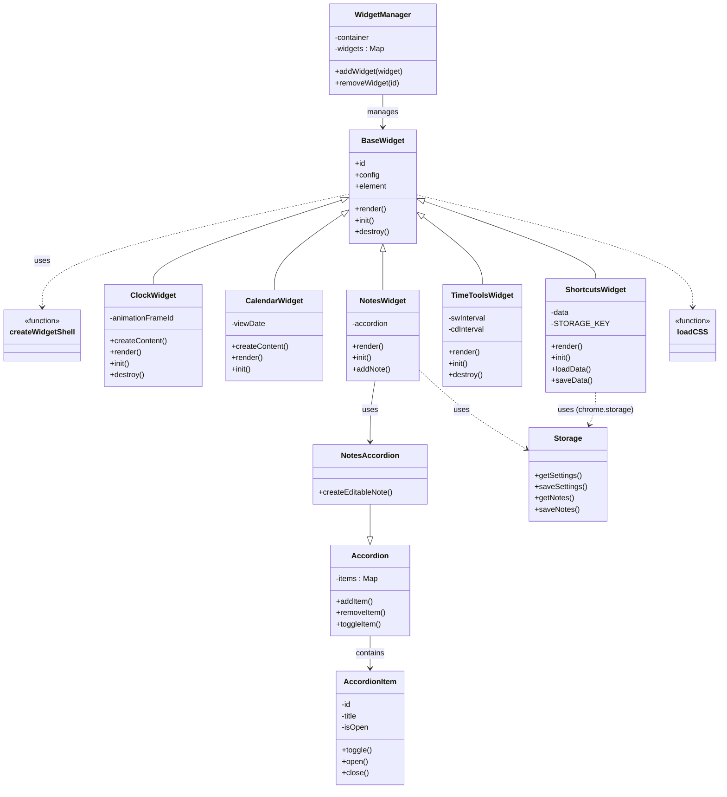

NovaTab is a Chrome extension that replaces the default New Tab page with a unified, customizable workspace featuring search, themes, and productivity widgets.

```mermaid
classDiagram

%% ======================
%% CORE BASE
%% ======================
class BaseWidget {
  +id
  +config
  +element
  +render()
  +init()
  +destroy()
}

%% ======================
%% MANAGER
%% ======================
class WidgetManager {
  -container
  -widgets : Map
  +addWidget(widget)
  +removeWidget(id)
}

WidgetManager --> BaseWidget : manages

%% ======================
%% WIDGET SHELL (UTILITY)
%% ======================
class createWidgetShell {
  <<function>>
}

BaseWidget ..> createWidgetShell : uses

%% ======================
%% WIDGETS
%% ======================
class ClockWidget {
  -animationFrameId
  +createContent()
  +render()
  +init()
  +destroy()
}

class CalendarWidget {
  -viewDate
  +createContent()
  +render()
  +init()
}

class ShortcutsWidget {
  -data
  -STORAGE_KEY
  +render()
  +init()
  +loadData()
  +saveData()
}

class TimeToolsWidget {
  -swInterval
  -cdInterval
  +render()
  +init()
  +destroy()
}

class NotesWidget {
  -accordion
  +render()
  +init()
  +addNote()
}

%% Inheritance
BaseWidget <|-- ClockWidget
BaseWidget <|-- CalendarWidget
BaseWidget <|-- ShortcutsWidget
BaseWidget <|-- TimeToolsWidget
BaseWidget <|-- NotesWidget

%% ======================
%% ACCORDION SYSTEM
%% ======================
class Accordion {
  -items : Map
  +addItem()
  +removeItem()
  +toggleItem()
}

class AccordionItem {
  -id
  -title
  -isOpen
  +toggle()
  +open()
  +close()
}

class NotesAccordion {
  +createEditableNote()
}

Accordion --> AccordionItem : contains
NotesAccordion --|> Accordion

NotesWidget --> NotesAccordion : uses

%% ======================
%% STORAGE
%% ======================
class Storage {
  +getSettings()
  +saveSettings()
  +getNotes()
  +saveNotes()
}

NotesWidget ..> Storage : uses
ShortcutsWidget ..> Storage : uses (chrome.storage)

%% ======================
%% UTILITIES
%% ======================
class loadCSS {
  <<function>>
}

BaseWidget ..> loadCSS
```
