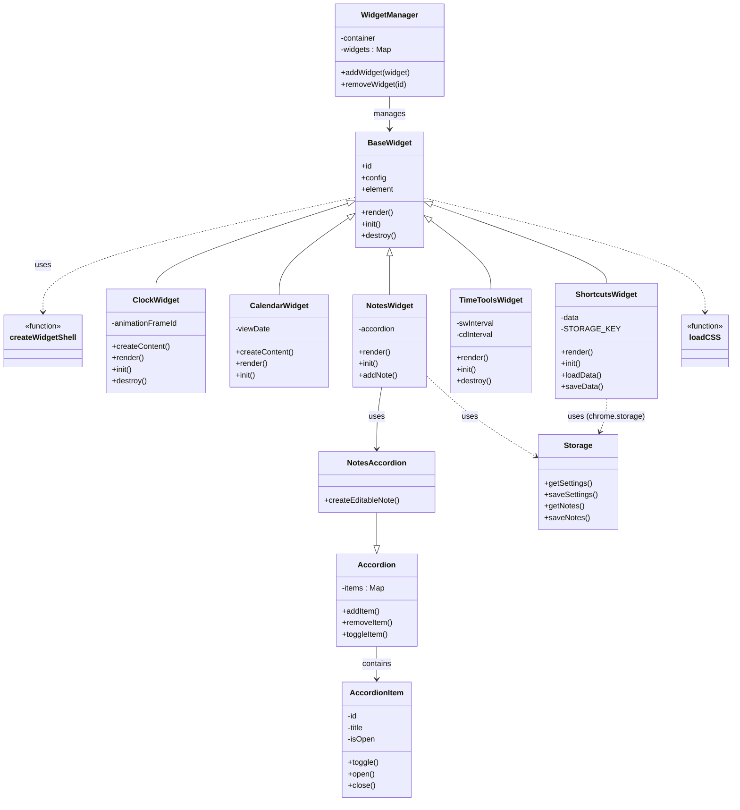

# 🚀 NovaTab - Customizable New Tab Extension

NovaTab is a modern, extensible browser new tab experience built with a modular widget system.  
It allows users to personalize their dashboard with interactive widgets, utilities, and quick tools — all in a clean and flexible UI.

---

## ✨ Features

### 🧩 Extensible Widget System
NovaTab is built around a powerful widget architecture.

- Widgets are **independent, self-contained modules**
- Easily add, remove, or extend widgets without affecting others
- Each widget follows a consistent lifecycle (`render → init → destroy`)
- Managed centrally via a Widget Manager system :contentReference[oaicite:0]{index=0}

#### Current Widgets
- 🕒 Clock
- 📅 Calendar
- 🔗 Shortcuts (with import/export support)
- ⏱️ Time Tools (Stopwatch & Countdown)
- 📝 Notes (rich text editor with accordion UI)

The system is designed so developers can **plug in new widgets with minimal effort**.

---

### 🧠 Smart Storage Strategy
NovaTab uses a hybrid storage approach:

- `chrome.storage.sync` → for settings (lightweight, synced across devices)
- `chrome.storage.local` → for larger data like notes (HTML content) :contentReference[oaicite:1]{index=1}

This ensures:
- ⚡ Performance
- ☁️ Sync where needed
- 📦 Efficient handling of large data

---

### 🎛️ Side Panel Integration
NovaTab includes a lightweight side panel for quick actions and future extensibility.

- Designed as a **control surface / utility panel**
- Can be extended to include:
  - Quick settings
  - Widget toggles
  - Contextual tools

(Current implementation is minimal and evolving) :contentReference[oaicite:2]{index=2}

---

### 🎨 Customization & Settings
- Theme switching (light/dark)
- Search engine selection
- Configurable UI behavior
- API key integration support (e.g., maps, weather)

Settings are persisted and loaded dynamically :contentReference[oaicite:3]{index=3}

---

### 🔍 Built-in Search
- Supports multiple engines (Google, Bing, DuckDuckGo)
- Quick search directly from the new tab
- Configurable default engine :contentReference[oaicite:4]{index=4}

---

## 🏗️ Architecture Overview

