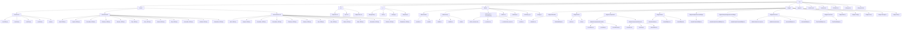

```mermaid
graph TD
N0["root"]
N1["assets/"]
N0 --> N1
N2["css/"]
N0 --> N2
N3["js/"]
N0 --> N3
N4["utilities/"]
N0 --> N4
N5["widgets/"]
N0 --> N5
N6[".gitignore"]
N0 --> N6
N7["manifest.json"]
N0 --> N7
N8["newtab.html"]
N0 --> N8
N9["README.md"]
N0 --> N9
N10["settings.html"]
N0 --> N10
N11["sidepanel.html"]
N0 --> N11
N1["assets"]
N12["icons/"]
N1 --> N12
N13["months/"]
N1 --> N13
N14["months-old/"]
N1 --> N14
N12["assets/icons"]
N15["icon128.png"]
N12 --> N15
N16["icon16.png"]
N12 --> N16
N17["icon32.png"]
N12 --> N17
N18["icon48.png"]
N12 --> N18
N19["raw.png"]
N12 --> N19
N13["assets/months"]
N20["April_2026.jpg"]
N13 --> N20
N21["August_2026.jpg"]
N13 --> N21
N22["December_2026.jpg"]
N13 --> N22
N23["February_2026.jpg"]
N13 --> N23
N24["January_2026.jpg"]
N13 --> N24
N25["July_2026.jpg"]
N13 --> N25
N26["June_2026.jpg"]
N13 --> N26
N27["March_2026.jpg"]
N13 --> N27
N28["May_2026.jpg"]
N13 --> N28
N29["November_2026.jpg"]
N13 --> N29
N30["October_2026.jpg"]
N13 --> N30
N31["September_2026.jpg"]
N13 --> N31
N14["assets/months-old"]
N32["April_2026.jpg"]
N14 --> N32
N33["August_2026.jpg"]
N14 --> N33
N34["December_2025.jpg"]
N14 --> N34
N35["December_2026.jpg"]
N14 --> N35
N36["February_2026.jpg"]
N14 --> N36
N37["January_2026.jpg"]
N14 --> N37
N38["July_2026.jpg"]
N14 --> N38
N39["June_2026.jpg"]
N14 --> N39
N40["March_2026.jpg"]
N14 --> N40
N41["May_2026.jpg"]
N14 --> N41
N42["November_2026.jpg"]
N14 --> N42
N43["October_2026.jpg"]
N14 --> N43
N44["September_2026.jpg"]
N14 --> N44
N2["css"]
N45["sidepanel.css"]
N2 --> N45
N46["style.css"]
N2 --> N46
N47["widget-base.css"]
N2 --> N47
N3["js"]
N48["background.js"]
N3 --> N48
N49["main.js"]
N3 --> N49
N50["settings.js"]
N3 --> N50
N51["sidepanel.js"]
N3 --> N51
N4["utilities"]
N52["modal/"]
N4 --> N52
N53["notify/"]
N4 --> N53
N54["python-housekeeping/"]
N4 --> N54
N55["loadcss.js"]
N4 --> N55
N56["loadscript.js"]
N4 --> N56
N57["loadscript_1.js"]
N4 --> N57
N58["storage.js"]
N4 --> N58
N52["utilities/modal"]
N59["modal.css"]
N52 --> N59
N60["modal.js"]
N52 --> N60
N53["utilities/notify"]
N61["builder.js"]
N53 --> N61
N62["handlers.js"]
N53 --> N62
N63["notify.js"]
N53 --> N63
N54["utilities/python-housekeeping"]
N64["folder_structure.md"]
N54 --> N64
N65["js_analyze.py"]
N54 --> N65
N66["js_architecture_report.txt"]
N54 --> N66
N67["script1.py"]
N54 --> N67
N5["widgets"]
N68["Calendar/"]
N5 --> N68
N69["Clock/"]
N5 --> N69
N70["components/"]
N5 --> N70
N71["Notes/"]
N5 --> N71
N72["sampleCarouselWidget/"]
N5 --> N72
N73["sampleImageCarouselWidget/"]
N5 --> N73
N74["Shortcuts/"]
N5 --> N74
N75["TimeTools/"]
N5 --> N75
N76["widget-base.js"]
N5 --> N76
N77["widget-config.js"]
N5 --> N77
N78["widget-host.js"]
N5 --> N78
N79["widget-manager.js"]
N5 --> N79
N80["widget-shell.js"]
N5 --> N80
N68["widgets/Calendar"]
N81["calendar.css"]
N68 --> N81
N82["CalendarWidget.js"]
N68 --> N82
N69["widgets/Clock"]
N83["clock.css"]
N69 --> N83
N84["clock.js"]
N69 --> N84
N70["widgets/components"]
N85["Accordion/"]
N70 --> N85
N86["Carousel/"]
N70 --> N86
N85["widgets/components/Accordion"]
N87["Accordion.css"]
N85 --> N87
N88["Accordion.js"]
N85 --> N88
N89["AccordionItem.js"]
N85 --> N89
N86["widgets/components/Carousel"]
N90["Carousel.css"]
N86 --> N90
N91["Carousel.js"]
N86 --> N91
N92["CarouselItem.js"]
N86 --> N92
N71["widgets/Notes"]
N93["NotesAccordion.js"]
N71 --> N93
N94["NotesWidget.css"]
N71 --> N94
N95["NotesWidget.js"]
N71 --> N95
N72["widgets/sampleCarouselWidget"]
N96["sampleCarouselWidget.js"]
N72 --> N96
N73["widgets/sampleImageCarouselWidget"]
N97["sampleImageCarouselWidget.css"]
N73 --> N97
N98["sampleImageCarouselWidget.js"]
N73 --> N98
N74["widgets/Shortcuts"]
N99["default-shortcuts copy.json"]
N74 --> N99
N100["default-shortcuts.json"]
N74 --> N100
N101["shortcutsWidget.css"]
N74 --> N101
N102["shortcutsWidget.js"]
N74 --> N102
N75["widgets/TimeTools"]
N103["TimeToolsWidget.css"]
N75 --> N103
N104["TimeToolsWidget.js"]
N75 --> N104
```