# 📊 JavaScript Architecture Report

## 📁 `utilities/modal/modal.js`

### 📦 Classes
- `Modal`

### 🏷️ Properties (`this.*`)
- `this.close`
- `this.modal`
- `this.overlay`

### ⚙️ Methods
- `close()`
- `open()`

### 🔗 External Calls
- `body.appendChild()`
- `document.createElement()`
- `header.appendChild()`
- `odal.appendChild()`
- `this.close()`
- `verlay.appendChild()`
- `verlay.remove()`

---

## 📁 `utilities/notify/notify.js`

### 📦 Classes
- `Notify`

### 🏷️ Properties (`this.*`)
- `this.handlers`

### ⚙️ Methods
- `clear()`
- `create()`

### 🔗 External Calls
- `Date.now()`
- `andlers.delete()`
- `andlers.set()`
- `notifications.clear()`
- `notifications.create()`

---

## 📁 `widgets/widget-base.js`

### 📦 Classes
- `BaseWidget`

### 🏷️ Properties (`this.*`)
- `this.config`
- `this.element`
- `this.id`

### ⚙️ Methods
- `destroy()`
- `init()`
- `render()`

### 🔗 External Calls
- `element.remove()`

---

## 📁 `widgets/widget-host.js`

### 📦 Classes
- `WidgetHost`

### 🏷️ Properties (`this.*`)
- `this.managers`

### ⚙️ Methods
- `getManager()`
- `mountWidget()`
- `registerContainer()`

### 🔗 External Calls
- `managers.get()`
- `managers.set()`
- `document.getElementById()`
- `manager.addWidget()`

---

## 📁 `widgets/widget-manager.js`

### 📦 Classes
- `WidgetManager`

### 🏷️ Properties (`this.*`)
- `this._clearDropIndicators`
- `this._handleDrop`
- `this._makeDraggable`
- `this._showDropIndicator`
- `this.container`
- `this.draggedId`
- `this.layout`
- `this.render`
- `this.widgets`

### ⚙️ Methods
- `_clearDropIndicators()`
- `_handleDrop()`
- `_makeDraggable()`
- `_showDropIndicator()`
- `addWidget()`
- `removeWidget()`
- `render()`

### 🔗 External Calls
- `layout.indexOf()`
- `layout.push()`
- `layout.splice()`
- `classList.add()`
- `classList.remove()`
- `dataTransfer.setDragImage()`
- `e.preventDefault()`
- `el.addEventListener()`
- `el.getBoundingClientRect()`
- `widgets.delete()`
- `widgets.get()`
- `widgets.set()`
- `container.appendChild()`
- `container.querySelector()`
- `container.querySelectorAll()`
- `targetEl.getBoundingClientRect()`
- `this._clearDropIndicators()`
- `this._handleDrop()`
- `this._makeDraggable()`
- `this._showDropIndicator()`
- `this.render()`
- `widget.destroy()`
- `widgetInstance.init()`
- `widgetInstance.render()`

---

## 📁 `widgets/Calendar/CalendarWidget.js`

### 📦 Classes
- `CalendarWidget`

### 🏷️ Properties (`this.*`)
- `this.bindEvents`
- `this.createContent`
- `this.destroy`
- `this.element`
- `this.id`
- `this.renderCalendar`
- `this.viewDate`

### ⚙️ Methods
- `bindEvents()`
- `createContent()`
- `destroy()`
- `init()`
- `render()`
- `renderCalendar()`

### 🔗 External Calls
- `classList.add()`
- `classList.remove()`
- `document.createElement()`
- `viewDate.getFullYear()`
- `viewDate.getMonth()`
- `viewDate.setMonth()`
- `viewDate.toLocaleString()`
- `element.querySelector()`
- `runtime.getURL()`
- `super.destroy()`
- `this.bindEvents()`
- `this.createContent()`
- `this.destroy()`
- `this.renderCalendar()`

---

## 📁 `widgets/Clock/clock.js`

### 📦 Classes
- `ClockWidget`

### 🏷️ Properties (`this.*`)
- `this.animationFrameId`
- `this.bindEvents`
- `this.createContent`
- `this.drawClockFace`
- `this.element`
- `this.id`
- `this.startTicker`

### ⚙️ Methods
- `bindEvents()`
- `createContent()`
- `destroy()`
- `drawClockFace()`
- `init()`
- `render()`
- `startTicker()`

### 🔗 External Calls
- `body.contains()`
- `classList.add()`
- `classList.contains()`
- `classList.remove()`
- `document.createElement()`
- `element.querySelector()`
- `modeBtn.addEventListener()`
- `now.getHours()`
- `now.getMinutes()`
- `now.getSeconds()`
- `now.toLocaleDateString()`
- `now.toLocaleTimeString()`
- `numsContainer.appendChild()`
- `super.destroy()`
- `this.bindEvents()`
- `this.createContent()`
- `this.drawClockFace()`
- `this.startTicker()`

---

## 📁 `widgets/components/Accordion/Accordion.js`

### 📦 Classes
- `Accordion`

### 🏷️ Properties (`this.*`)
- `this._closeAllExcept`
- `this.config`
- `this.element`
- `this.items`

### ⚙️ Methods
- `_closeAllExcept()`
- `addItem()`
- `destroy()`
- `init()`
- `removeItem()`
- `render()`
- `toggleItem()`

### 🔗 External Calls
- `document.createElement()`
- `element.remove()`
- `item.close()`
- `item.toggle()`
- `element.appendChild()`
- `element.remove()`
- `tems.delete()`
- `tems.entries()`
- `tems.get()`
- `tems.set()`
- `this._closeAllExcept()`

---

## 📁 `widgets/components/Accordion/AccordionItem.js`

### 📦 Classes
- `AccordionItem`

### 🏷️ Properties (`this.*`)
- `this.close`
- `this.contentEl`
- `this.element`
- `this.id`
- `this.isOpen`
- `this.onToggle`
- `this.open`
- `this.render`
- `this.title`
- `this.toggle`

### ⚙️ Methods
- `close()`
- `open()`
- `render()`
- `toggle()`

### 🔗 External Calls
- `body.appendChild()`
- `classList.add()`
- `classList.remove()`
- `document.createElement()`
- `element.querySelector()`
- `this.close()`
- `this.onToggle()`
- `this.open()`
- `this.render()`
- `this.toggle()`
- `wrapper.querySelector()`

---

## 📁 `widgets/components/Carousel/Carousel.js`

### 📦 Classes
- `Carousel`

### 🏷️ Properties (`this.*`)
- `this._updateUI`
- `this.autoPlayTimer`
- `this.config`
- `this.currentIndex`
- `this.element`
- `this.items`
- `this.next`
- `this.nextBtn`
- `this.prev`
- `this.prevBtn`
- `this.resetAutoPlay`
- `this.startAutoPlay`
- `this.stopAutoPlay`
- `this.track`

### ⚙️ Methods
- `_updateUI()`
- `addItem()`
- `destroy()`
- `init()`
- `next()`
- `prev()`
- `render()`
- `resetAutoPlay()`
- `startAutoPlay()`
- `stopAutoPlay()`

### 🔗 External Calls
- `document.createElement()`
- `element.addEventListener()`
- `element.appendChild()`
- `element.remove()`
- `rack.appendChild()`
- `tems.push()`
- `this._updateUI()`
- `this.next()`
- `this.prev()`
- `this.resetAutoPlay()`
- `this.startAutoPlay()`
- `this.stopAutoPlay()`

---

## 📁 `widgets/components/Carousel/CarouselItem.js`

### 📦 Classes
- `CarouselItem`

### 🏷️ Properties (`this.*`)
- `this.contentEl`
- `this.element`
- `this.id`
- `this.render`

### ⚙️ Methods
- `render()`

### 🔗 External Calls
- `document.createElement()`
- `this.render()`
- `wrapper.appendChild()`

---

## 📁 `widgets/Notes/NotesAccordion.js`

### 📦 Classes
- `NotesAccordion`

### ⚙️ Methods
- `createEditableNote()`
- `init()`

### 🔗 External Calls
- `classList.contains()`
- `colorPicker.addEventListener()`
- `container.appendChild()`
- `container.closest()`
- `document.createElement()`
- `document.execCommand()`
- `e.preventDefault()`
- `formatSelect.addEventListener()`
- `formatSelect.appendChild()`
- `formats.forEach()`
- `separator1.cloneNode()`
- `super.init()`
- `toolbar.appendChild()`

---

## 📁 `widgets/Notes/NotesWidget.js`

### 📦 Classes
- `NotesWidget`

### 🏷️ Properties (`this.*`)
- `this.accordion`
- `this.addNote`
- `this.element`
- `this.id`
- `this.renderNoteToDOM`

### ⚙️ Methods
- `addNote()`
- `init()`
- `render()`
- `renderNoteToDOM()`

### 🔗 External Calls
- `Date.now()`
- `Object.keys()`
- `accordion.addItem()`
- `accordion.createEditableNote()`
- `accordion.init()`
- `accordion.render()`
- `accordion.toggleItem()`
- `document.createElement()`
- `header.appendChild()`
- `element.querySelector()`
- `this.addNote()`
- `this.renderNoteToDOM()`

---

## 📁 `widgets/sampleCarouselWidget/sampleCarouselWidget.js`

### 📦 Classes
- `sampleCarouselWidget`

### 🏷️ Properties (`this.*`)
- `this.animationFrameId`
- `this.carousel`
- `this.createContent`
- `this.element`
- `this.id`

### ⚙️ Methods
- `createContent()`
- `destroy()`
- `init()`
- `render()`

### 🔗 External Calls
- `arousel.addItem()`
- `arousel.init()`
- `arousel.render()`
- `document.createElement()`
- `super.destroy()`
- `this.createContent()`

---

## 📁 `widgets/sampleImageCarouselWidget/sampleImageCarouselWidget.js`

### 📦 Classes
- `sampleImageCarouselWidget`

### 🏷️ Properties (`this.*`)
- `this.createContent`
- `this.element`
- `this.id`
- `this.imageCarousel`
- `this.preloadImage`

### ⚙️ Methods
- `createContent()`
- `destroy()`
- `init()`
- `preloadImage()`
- `render()`

### 🔗 External Calls
- `document.createElement()`
- `mageCarousel.addItem()`
- `mageCarousel.destroy()`
- `mageCarousel.init()`
- `mageCarousel.render()`
- `super.destroy()`
- `this.createContent()`
- `this.preloadImage()`

---

## 📁 `widgets/Shortcuts/shortcutsWidget.js`

### 📦 Classes
- `ShortcutsWidget`

### 🏷️ Properties (`this.*`)
- `this.MAX_RECORDS`
- `this.STORAGE_KEY`
- `this.bindEvents`
- `this.data`
- `this.element`
- `this.id`
- `this.loadData`
- `this.loadDefaultShortcuts`
- `this.renderTable`
- `this.saveData`
- `this.syncFromUI`

### ⚙️ Methods
- `bindEvents()`
- `init()`
- `loadData()`
- `loadDefaultShortcuts()`
- `render()`
- `renderTable()`
- `saveData()`
- `syncFromUI()`

### 🔗 External Calls
- `Array.isArray()`
- `JSON.parse()`
- `addBtn.addEventListener()`
- `ata.forEach()`
- `ata.push()`
- `ata.splice()`
- `classList.contains()`
- `document.createElement()`
- `file.text()`
- `fileInput.addEventListener()`
- `fileInput.click()`
- `importBtn.addEventListener()`
- `json.every()`
- `json.slice()`
- `element.addEventListener()`
- `element.querySelector()`
- `element.querySelectorAll()`
- `local.get()`
- `local.set()`
- `response.json()`
- `runtime.getURL()`
- `tbody.appendChild()`
- `this.bindEvents()`
- `this.loadData()`
- `this.loadDefaultShortcuts()`
- `this.renderTable()`
- `this.saveData()`
- `this.syncFromUI()`
- `value.trim()`

---

## 📁 `widgets/TimeTools/TimeToolsWidget.js`

### 📦 Classes
- `TimeToolsWidget`

### 🏷️ Properties (`this.*`)
- `this.cdInterval`
- `this.cdRunning`
- `this.element`
- `this.id`
- `this.swInterval`
- `this.swRunning`

### ⚙️ Methods
- `destroy()`
- `init()`
- `render()`

### 🔗 External Calls
- `Date.now()`
- `classList.add()`
- `classList.remove()`
- `content.querySelector()`
- `document.createElement()`
- `modal.close()`
- `modal.open()`
- `notifications.create()`
- `notify.create()`
- `root.querySelector()`
- `super.destroy()`

---

# 🧠 Class Diagram

```mermaid
classDiagram
class Modal
class Notify
class BaseWidget
class WidgetHost
class WidgetManager
class CalendarWidget
class ClockWidget
class Accordion
class AccordionItem
class Carousel
class CarouselItem
class NotesAccordion
class NotesWidget
class sampleCarouselWidget
class sampleImageCarouselWidget
class ShortcutsWidget
class TimeToolsWidget
Modal : +open()
Modal : +close()
Modal : modal
Modal : overlay
Modal : close
Notify : +clear()
Notify : +create()
Notify : handlers
BaseWidget : +render()
BaseWidget : +destroy()
BaseWidget : +init()
BaseWidget : id
BaseWidget : config
BaseWidget : element
WidgetHost : +mountWidget()
WidgetHost : +getManager()
WidgetHost : +registerContainer()
WidgetHost : managers
WidgetManager : +render()
WidgetManager : +_makeDraggable()
WidgetManager : +addWidget()
WidgetManager : +_handleDrop()
WidgetManager : +_showDropIndicator()
WidgetManager : +removeWidget()
WidgetManager : +_clearDropIndicators()
WidgetManager : render
WidgetManager : _makeDraggable
WidgetManager : draggedId
WidgetManager : _handleDrop
WidgetManager : _showDropIndicator
WidgetManager : widgets
WidgetManager : layout
WidgetManager : container
WidgetManager : _clearDropIndicators
CalendarWidget : +render()
CalendarWidget : +destroy()
CalendarWidget : +init()
CalendarWidget : +renderCalendar()
CalendarWidget : +bindEvents()
CalendarWidget : +createContent()
CalendarWidget : destroy
CalendarWidget : id
CalendarWidget : renderCalendar
CalendarWidget : element
CalendarWidget : bindEvents
CalendarWidget : viewDate
CalendarWidget : createContent
ClockWidget : +render()
ClockWidget : +drawClockFace()
ClockWidget : +destroy()
ClockWidget : +init()
ClockWidget : +startTicker()
ClockWidget : +bindEvents()
ClockWidget : +createContent()
ClockWidget : id
ClockWidget : drawClockFace
ClockWidget : element
ClockWidget : startTicker
ClockWidget : bindEvents
ClockWidget : animationFrameId
ClockWidget : createContent
Accordion : +render()
Accordion : +destroy()
Accordion : +_closeAllExcept()
Accordion : +removeItem()
Accordion : +addItem()
Accordion : +toggleItem()
Accordion : +init()
Accordion : _closeAllExcept
Accordion : items
Accordion : element
Accordion : config
AccordionItem : +render()
AccordionItem : +open()
AccordionItem : +toggle()
AccordionItem : +close()
AccordionItem : title
AccordionItem : id
AccordionItem : render
AccordionItem : contentEl
AccordionItem : isOpen
AccordionItem : element
AccordionItem : close
AccordionItem : open
AccordionItem : onToggle
AccordionItem : toggle
Carousel : +render()
Carousel : +destroy()
Carousel : +next()
Carousel : +startAutoPlay()
Carousel : +resetAutoPlay()
Carousel : +prev()
Carousel : +_updateUI()
Carousel : +addItem()
Carousel : +init()
Carousel : +stopAutoPlay()
Carousel : next
Carousel : track
Carousel : prevBtn
Carousel : startAutoPlay
Carousel : resetAutoPlay
Carousel : prev
Carousel : nextBtn
Carousel : _updateUI
Carousel : autoPlayTimer
Carousel : items
Carousel : element
Carousel : currentIndex
Carousel : config
Carousel : stopAutoPlay
CarouselItem : +render()
CarouselItem : render
CarouselItem : id
CarouselItem : element
CarouselItem : contentEl
NotesAccordion : +createEditableNote()
NotesAccordion : +init()
NotesWidget : +render()
NotesWidget : +init()
NotesWidget : +addNote()
NotesWidget : +renderNoteToDOM()
NotesWidget : renderNoteToDOM
NotesWidget : id
NotesWidget : addNote
NotesWidget : accordion
NotesWidget : element
sampleCarouselWidget : +render()
sampleCarouselWidget : +destroy()
sampleCarouselWidget : +createContent()
sampleCarouselWidget : +init()
sampleCarouselWidget : id
sampleCarouselWidget : element
sampleCarouselWidget : carousel
sampleCarouselWidget : animationFrameId
sampleCarouselWidget : createContent
sampleImageCarouselWidget : +render()
sampleImageCarouselWidget : +destroy()
sampleImageCarouselWidget : +init()
sampleImageCarouselWidget : +preloadImage()
sampleImageCarouselWidget : +createContent()
sampleImageCarouselWidget : id
sampleImageCarouselWidget : preloadImage
sampleImageCarouselWidget : imageCarousel
sampleImageCarouselWidget : element
sampleImageCarouselWidget : createContent
ShortcutsWidget : +render()
ShortcutsWidget : +saveData()
ShortcutsWidget : +loadDefaultShortcuts()
ShortcutsWidget : +loadData()
ShortcutsWidget : +renderTable()
ShortcutsWidget : +bindEvents()
ShortcutsWidget : +syncFromUI()
ShortcutsWidget : +init()
ShortcutsWidget : id
ShortcutsWidget : bindEvents
ShortcutsWidget : saveData
ShortcutsWidget : STORAGE_KEY
ShortcutsWidget : loadDefaultShortcuts
ShortcutsWidget : syncFromUI
ShortcutsWidget : loadData
ShortcutsWidget : element
ShortcutsWidget : renderTable
ShortcutsWidget : MAX_RECORDS
ShortcutsWidget : data
TimeToolsWidget : +render()
TimeToolsWidget : +destroy()
TimeToolsWidget : +init()
TimeToolsWidget : id
TimeToolsWidget : swInterval
TimeToolsWidget : swRunning
TimeToolsWidget : cdInterval
TimeToolsWidget : cdRunning
TimeToolsWidget : element
Notify --> Date
NotesWidget --> Date
NotesWidget --> Object
ShortcutsWidget --> JSON
ShortcutsWidget --> Array
TimeToolsWidget --> Date
```

