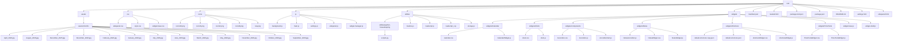

```mermaid
graph TD
N0["root"]
N1["assets/"]
N0 --> N1
N2["css/"]
N0 --> N2
N3["icons/"]
N0 --> N3
N4["js/"]
N0 --> N4
N5["utilities/"]
N0 --> N5
N6["widgets/"]
N0 --> N6
N7["manifest.json"]
N0 --> N7
N8["newtab.html"]
N0 --> N8
N9["package-lock.json"]
N0 --> N9
N10["package.json"]
N0 --> N10
N11["README.md"]
N0 --> N11
N12["settings.html"]
N0 --> N12
N13["sidepanel.html"]
N0 --> N13
N1["assets"]
N14["months/"]
N1 --> N14
N14["assets/months"]
N15["April_2026.jpg"]
N14 --> N15
N16["August_2026.jpg"]
N14 --> N16
N17["December_2025.jpg"]
N14 --> N17
N18["December_2026.jpg"]
N14 --> N18
N19["February_2026.jpg"]
N14 --> N19
N20["January_2026.jpg"]
N14 --> N20
N21["July_2026.jpg"]
N14 --> N21
N22["June_2026.jpg"]
N14 --> N22
N23["March_2026.jpg"]
N14 --> N23
N24["May_2026.jpg"]
N14 --> N24
N25["November_2026.jpg"]
N14 --> N25
N26["October_2026.jpg"]
N14 --> N26
N27["September_2026.jpg"]
N14 --> N27
N2["css"]
N28["sidepanel.css"]
N2 --> N28
N29["style.css"]
N2 --> N29
N30["widget-base.css"]
N2 --> N30
N3["icons"]
N31["icon128.png"]
N3 --> N31
N32["icon16.png"]
N3 --> N32
N33["icon32.png"]
N3 --> N33
N34["icon48.png"]
N3 --> N34
N35["raw.png"]
N3 --> N35
N4["js"]
N36["background.js"]
N4 --> N36
N37["main.js"]
N4 --> N37
N38["settings.js"]
N4 --> N38
N39["sidepanel.js"]
N4 --> N39
N40["widget-manager.js"]
N4 --> N40
N5["utilities"]
N41["python-housekeeping/"]
N5 --> N41
N42["loadcss.js"]
N5 --> N42
N43["loadscript.js"]
N5 --> N43
N44["loadscript_1.js"]
N5 --> N44
N45["storage.js"]
N5 --> N45
N41["utilities/python-housekeeping"]
N46["script1.py"]
N41 --> N46
N6["widgets"]
N47["Calendar/"]
N6 --> N47
N48["Clock/"]
N6 --> N48
N49["components/"]
N6 --> N49
N50["Notes/"]
N6 --> N50
N51["Shortcuts/"]
N6 --> N51
N52["TimeTools/"]
N6 --> N52
N53["widget-base.js"]
N6 --> N53
N54["widget-shell.js"]
N6 --> N54
N47["widgets/Calendar"]
N55["calendar.css"]
N47 --> N55
N56["CalendarWidget.js"]
N47 --> N56
N48["widgets/Clock"]
N57["clock.css"]
N48 --> N57
N58["clock.js"]
N48 --> N58
N49["widgets/components"]
N59["Accordion.css"]
N49 --> N59
N60["Accordion.js"]
N49 --> N60
N61["AccordionItem.js"]
N49 --> N61
N50["widgets/Notes"]
N62["NotesAccordion.js"]
N50 --> N62
N63["NotesWidget.css"]
N50 --> N63
N64["NotesWidget.js"]
N50 --> N64
N51["widgets/Shortcuts"]
N65["default-shortcuts copy.json"]
N51 --> N65
N66["default-shortcuts.json"]
N51 --> N66
N67["shortcutsWidget.css"]
N51 --> N67
N68["shortcutsWidget.js"]
N51 --> N68
N52["widgets/TimeTools"]
N69["TimeToolsWidget.css"]
N52 --> N69
N70["TimeToolsWidget.js"]
N52 --> N70
```